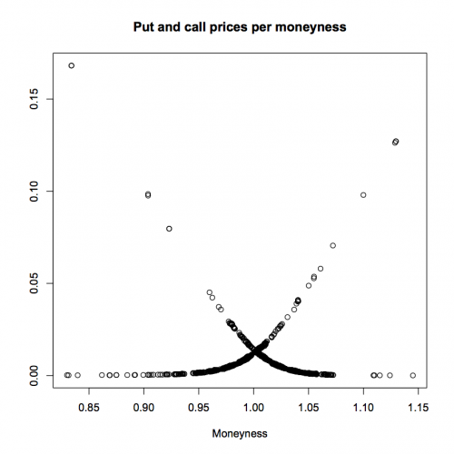
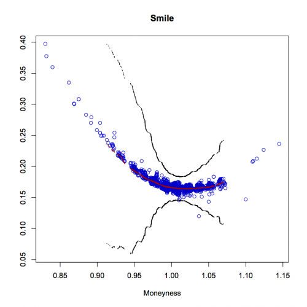
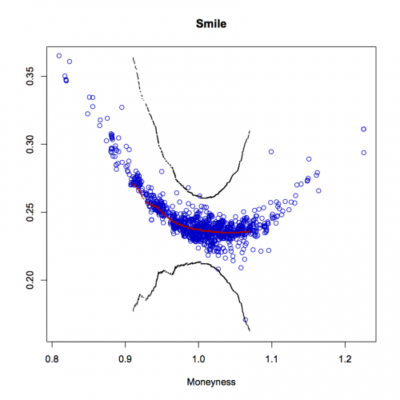

[](http://quantlet.de/)

## [](http://quantlet.de/) **XFGLSK** [](http://quantlet.de/)

```yaml

Name of QuantLet : XFGLSK

Published in : Applied Quantitative Finance

Description : 'Performes a Least Squares Kernel Smoothing technique for implied volatility smile
estimation. To achieve good forecast of asset price volatility the Gaussian shaped vega function is
used as weight. A quartic kernel is employed. Given global convexity, the Golden section search is
implemented with estimation tolerance 10e-5. The data consists of January and February 2001 tick
statistics of the DAX futures contracts and DAX index options. Since the data are transaction data
containing potential misprints, a filter in deleting all observations whose implied volatility is
bigger than 0.7 and less than 0.1 is applied. Plots of observed option price data are presented.
From the lower left to upper right put prices are displayed, from upper left to lower right
(normalized) call prices. Moreover, graphs of least squares kernel smoothed implied volatility
smile for 17 days to expiry (January 02, 2001) with bandwidth = 0.025 and 95 percent confidence
bands and 14 days to expiry (February 02, 2001) with bandwidth = 0.015 and 95 percent confidence
bands are shown. Regression smoothing is made employing a Nadaraya Watson kernel regression
estimate for quartic kernel'

Keywords : 'Golden section, LSKE, Nadaraya Watson, bandwidth, black-scholes, confidence-interval,
forecast, gaussian, implied-volatility, kde, kernel smoothing, least-squares, nonparametric,
nonparametric estimation, option, variance, vega, volatility smile'

See also : 'XFGIBT01, XFGIBT02, XFGIBT03, XFGiv00, XFGiv01, XFGiv02, XFGiv03, XFGiv04, XFGiv05,
XFGiv06'

Author : Awdesch Melzer

Submitted : Fri, June 06 2014 by Awdesch Melzer

Usage : 'Please choose data source and bandwidth: January or February'

Datafiles : FebruaryData.dat, JanuaryData.dat

Example : 'DAX option prices from 20010102, 17 days to expiry.Plot of observed option price data
are presented. From the lower left to upper right put prices are displayed, from upper left to
lower right (normalized) call prices.'

```









### R Code:
```r
# nadaraya watson kernel smoothing
sker = function(x, y, h, N, f, v) {
    # kernel regression smoothing for different kernel functions
    
    # kernel functions
    kern = function(x, f) {
        x = as.matrix(x)
        if (f == "gau") {
            # gaussian kernel
            y = dnorm(x)
        } else if (f == "qua") {
            # quadric / biweight kernel
            y = 0.9375 * (abs(x) < 1) * (1 - x^2)^2
        } else if (f == "cosi") {
            # cosine kernel
            y = (pi/4) * cos((pi/2) * x) * (abs(x) < 1)
        } else if (f == "tri") {
            # triweight kernel
            y = 35/32 * (abs(x) < 1) * (1 - x^2)^3
        } else if (f == "tria") {
            # triangular kernel
            y = (1 - abs(x)) * (abs(x) < 1)
        } else if (f == "uni") {
            # uniform kernel
            y = 0.5 * (abs(x) < 1)
        } else if (f == "spline") {
            y = 0.5 * (exp(-abs(x)/sqrt(2))) * (sin(abs(x)/sqrt(2) + pi/4))
        }
        return(y)
    }
    
    
    # Default parameters
    if (missing(N)) {
        N = 100
    }
    if (missing(f)) {
        f = "qua"
    }
    
    if (missing(v) == F) {
        v = sort(v)
    }
    
    r.n = length(x)
    if (missing(h)) {
        stop("There is no enough variation in the data. Regression is meaningless.")
    }
    r.h = h
    
    
    r.x = seq(min(x), max(x), length = N)
    r.f = matrix(0, N)
    for (k in 1:N) {
        z = kern((v[k] - x)/h, f)
        r.f[k] = sum(z * y)/sum(z)
    }
    
    return(list(mx = v, mh = r.f))
}


# Implied volatility surface estimation (IVS, gamma2, nu2)
IVSurface = function(VarEst, huse, dataday) {
    
    # fix bandwidth
    huse = huse
    
    if (missing("VarEst")) {
        # just estimate the function xmin = c(0.85, 0.047222) # February xmax = c(1.15, 0.047222)
        xmin = c(0.9, 0.047222)
        xmax = c(1.08, 0.047222)
        
        N = c(50, 1)
        xstep = (xmax - xmin)/N
        
        IVS = matrix(1, prod(N), 3)
        for (i in 1:2) {
            IVS[, i] = seq(xmin[i], xstep[i], length = N[1])
        }
    } else {
        # estimate the variance
        data = dataday
        # to estimate variance it is good to reduce the grid data = data[which(data[,7]>0.89),] # February data =
        # data[which(data[,7]<1.12),]
        data = data[which(data[, 7] > 0.91), ]  # January
        data = data[which(data[, 7] < 1.07), ]
        
        dim(data)
        data = data[, 1:9]
        data[, 9] = 0 * data[, 9]
        
        IVS = cbind(data[, 7], data[, 4], matrix(1, nrow(data), 1))
    }
    
    i = 1
    I = nrow(IVS)
    I
    while (i <= I) {
        x = t(IVS[i, 1:2])
        h = c(huse, 1)
        
        h <<- h  # set global parameter
        x <<- x
        
        sol = nmgolden(LSKernIVSEst, 0.01, 0.2, 0.85, 0.01, data, h, x)
        
        IVS[i, 3] = sol$xmin
        cbind(i, sol$xmin)
        if (missing("VarEst") == 0) {
            # if a variance is to be estimated
            data[i, 8] = sol$xmin
        }
        i = i + 1
    }
    
    gamma2 = 0
    nu2 = 0
    if (missing("VarEst") == 0) {
        # if a variance is to be estimated
        dataZZ = data
        dataZZ <<- dataZZ
        tmp = VarEstLSKS(data)
        gamma2 = tmp$gamma2
        nu2 = tmp$nu2
    }
    
    return(list(IVS = IVS, gamma2 = gamma2, nu2 = nu2))
}

# Golden section search
nmgolden = function(func, a, b, c, xtol, data, h, x) {
    
    deftol = 1e-08
    
    fa = 0
    fb = 0
    fc = 0
    fa = func(a, data, h, x)
    fb = func(b, data, h, x)
    fc = func(c, data, h, x)
    
    K = (3 - sqrt(5))/2  # the golden ratios
    R = 1 - K
    
    x0 = a
    x3 = c
    if (abs(c - b) > abs(b - a)) {
        x1 = b
        x2 = b + K * (c - b)
    } else {
        x2 = b
        x1 = b - K * (b - a)
    }
    
    f1 = 0
    f2 = 0
    f1 = func(x1, data, h, x)
    f2 = func(x2, data, h, x)
    
    while (abs(x3 - x0) > xtol * (abs(x1) + abs(x2))) {
        if (f2 < f1) {
            x0 = x1
            x1 = x2
            x2 = R * x1 + K * x3
            f1 = f2
            f2 = func(x2, data, h, x)
        } else {
            x3 = x2
            x2 = x1
            x1 = R * x2 + K * x0
            f2 = f1
            f1 = func(x1, data, h, x)
        }
    }
    
    if (f1 < f2) {
        xmin = x1
        fmin = f1
    } else {
        xmin = x2
        fmin = f2
    }
    
    return(list(xmin = xmin, fmin = fmin))
}


# general Black and Scholes fomula
BlackScholes = function(S, K, r, sigma, tau, task, d) {
    if (missing(d)) {
        d = matrix(0, length(S), 1)
    }
    b = r - d
    y = (log(S/K) + (b - (sigma^2)/2) * tau)/(sigma * sqrt(tau))
    # first part computes Call option, second the put:
    p = (exp((b - r) * tau) * S * pnorm(y + sigma * sqrt(tau)) - K * exp(-r * tau) * pnorm(y)) * (task == 1) + (K * exp(-r * 
        tau) * pnorm(-y) - exp((b - r) * tau) * S * pnorm(-y - sigma * sqrt(tau))) * (task == 0)
    if (any(p < 0)) {
        p[(p < 0)] = 0
    }
    return(p)
}

# Variance estimation with Least Squares Kernel Smoothing
VarEstLSKS = function(data) {
    S = data[, 1]
    K = data[, 2]
    r = data[, 3]
    tau = data[, 4]
    task = data[, 6]
    kappa = data[, 7]
    sigmahat = data[, 8]
    oprice = data[, 5]
    
    # compute A, B, D we do not need to adjust for moneyness as the spot cancels out:
    A = oprice - BlackScholes(S, K, r, sigmahat, tau, task)
    
    tmp = BSVegaVolga(S, K, r, sigmahat, tau, task)
    B = tmp$vega
    D = tmp$volga
    
    
    gamma2 = (mean(-B^2 + A * D))^2
    nu2 = mean((A^2) * (B^2)) * 25/49
    return(list(gamma2 = gamma2, nu2 = nu2))
    
    # intint K(u)^2 K(v)^2 dudv = 25/49 for quartic Kernel
    
}

# Black and Scholes Vega and Volga functions proc(vega, volga)
BSVegaVolga = function(S, K, r, sigma, tau, task, d) {
    if (missing(d)) {
        d = matrix(0, length(S), 1)
    }
    
    b = r - d
    d1 = (log(S/K) + (b + (sigma^2)/2) * tau)/(sigma * sqrt(tau))
    d2 = (log(S/K) + (b - (sigma^2)/2) * tau)/(sigma * sqrt(tau))
    vega = S * sqrt(tau) * dnorm(d1) * exp(-d * tau)
    volga1 = S * exp(-d * tau) * tau * dnorm(d1) * ((d1^2)/(sigma * sqrt(tau)) - d1)
    volga = S * exp(-d * tau) * sqrt(tau) * dnorm(d1) * (d1 * d2/sigma)
    return(list(vega = vega, volga = volga))
}

# Least Squares Kernel Estimation of Implied Volatility proc(Q) =
LSKernIVSEst = function(sigma, data, h, x) {
    sigmaB = sigma
    
    data = data  # (S, K, r, sigma, tau, task) 
    
    S = data[, 1]
    K = data[, 2]
    r = data[, 3]
    tau = data[, 4]
    task = data[, 6]
    kappa = data[, 7]
    oprice = data[, 5]
    
    # blow sigma up to fit with other data
    sigma = matrix(sigma, nrow(data), 1)
    
    # umoney and utau
    u = ((kappa - x[1])/h[1])
    Kern = 0.9375 * (abs(u) < 1) * (1 - u^2)^2  # quartic kernel
    
    resid = oprice/S - BlackScholes(S, K, r, sigma, tau, task)/S
    
    Q = sum((resid^2) * Kern)
    return(Q)
}


############################# MAIN COMPUTATION ############################


# to use please choose data source and bandwidth dataday = read.table('FebruaryData.dat')
dataday = read.table("JanuaryData.dat")

# choose bandwidth
hfeb = 0.017
hjan = 0.025

# huse is the bandwidth finally used
huse = hjan
# huse = hfeb

temp = IVSurface("VarEst", huse, dataday)  # {Smile, gamma2, nu2}
Smile = temp$IVS

Smile = cbind(Smile[, 1], Smile[, 3])

dataUnCorr = dataday

xUnCorr = cbind(dataUnCorr[, 7], dataUnCorr[, 8])

opPrices = cbind(dataUnCorr[, 7], (dataUnCorr[, 5]/dataUnCorr[, 1]))


# these numbers are precomputed as their computation is time consuming
gamma2 = 29176326722.4258
nu2 = 1482489.0485

# estimate densities on the grid of the Smile
Smile = Smile[order(Smile[, 1]), ]

hdens = 0.0365
fh = sker(x = seq(min(dataday[, 7]), max(dataday[, 7]), length = length(dataday[, 7])), y = dataday[, 7], h = hdens, N = length(Smile[, 
    1]), f = "qua", v = Smile[, 1])
sigma2band = nu2/(gamma2 * fh$mh)
n = nrow(dataday)
h = 0.025

# confidence bands
alpha = 0.05
sh = sker(x = seq(min(dataday[, 7]), max(dataday[, 7]), length = length(dataday[, 7])), y = dataday[, 7]^2, h = hdens, N = length(Smile[, 
    1]), f = "qua", v = Smile[, 1])

calpha = qnorm(1 - alpha/2)
mrg = calpha * sqrt(hdens * sh$mh/((n * h) * density(Smile[, 1], bw = h, cut = 1, kernel = "biweight", n = length(Smile[, 1]))$y))
clo = cbind(fh$mx, (Smile[, 2] - mrg))
cup = cbind(fh$mx, (Smile[, 2] + mrg))


plot(xUnCorr, col = "blue3", ylim = c(min(clo[, 2]), max(cup[, 2])), xlab = "Moneyness", ylab = "")
title("Smile")
points(Smile, pch = 16, cex = 0.3, col = "red3")
points(clo, pch = ".")
points(cup, pch = ".")

dev.new()
plot(opPrices, xlab = "Moneyness", ylab = "")
title("Put and call prices per moneyness")


 

```
