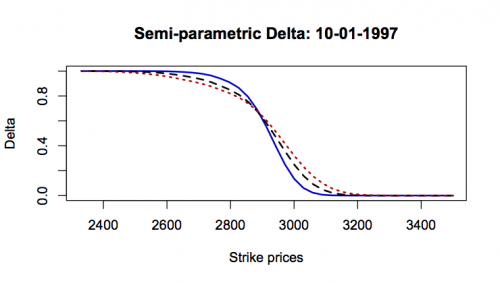
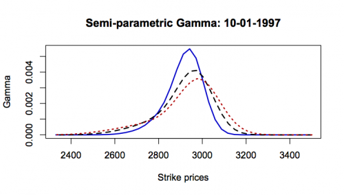
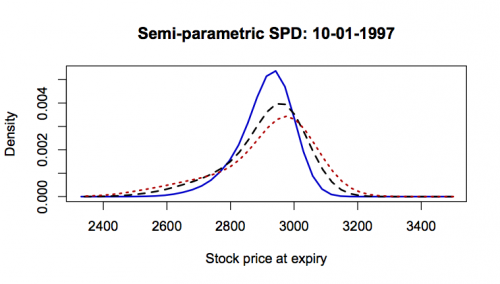

[](http://quantlet.de/)

## [](http://quantlet.de/) **XFGSPDoneday** [](http://quantlet.de/)

```yaml

Name of QuantLet : XFGSPDoneday

Published in : Applied Quantitative Finance

Description : 'Computes and plots the local polynomial state-price density for January 10, 1997 of
Dax data (1997-2001) for tau=0.125,0.25,0.375 employing Breeden and Litzenberger (BL) method and a
semi- parametric specification of the Black-Scholes option pricing function. The analytic formula
of the BL method uses an estimate of the volatility smile and its first and second derivative to
calculate the SPD, delta and gamma. Figures of state-price density, delta and gamma are presented
for tau=0.125,0.25,0.375 with blue, black and red lines, respectively. The date can be modified to
any day in the set of date=c(3,6,7,8,9,10,13,14,15,16,17, 20,21,22,23,24,27,28,29,30,31).'

Keywords : 'Breeden Litzenberger, SPD, bisection-method, black-scholes, delta, derivative,
european-option, gamma, implied-volatility, linear interpolation, local polynomial regression,
semiparametric, smoothing, state-price-density'

See also : XFGSPDcb, XFGSPDcb2, XFGSPDcom, XFGSPDonemonth

Author : Awdesch Melzer

Submitted : Wed, July 09 2014 by Awdesch Melzer

Datafile : XFGData9701.dat

Example : SPD of 10.01.1997 Dax for tau = c(0.125,0.25,0.375) with blue, black and red lines.

```








### R Code:
```r
rm(list=ls(all=TRUE))
graphics.off()

install.packages("locpol")
library(locpol)

# Specify your working directory
# setwd("Users...")

############################ SUBROUTINE ################################

spdbl = function(m, sigma, sigma1, sigma2, s, r, tau){ # (fstar,delta, gamma)
    # spdbl uses the Breeden and Litzenberger (1978) method and a
    #    semiparametric specification of the Black-Scholes
    #    option pricing function to calculate the empirical State 
    #    Price Density. The analytic formula uses an estimate of 
    #    the volatility smile and its first and second derivative to
    #    calculate the State-price density, as well as Delta and 
    #    Gamma of the option. This method can only be applied to
    #    European options (due to the assumptions).   
  
    rm   = length(m)
    ones = matrix(1,rm,1)
    st   = sqrt(tau)
    ert  = exp(r*tau)
    rt   = r*tau

    # Modified Black-Scholes scaled by S-div instead of F
    d1   = (log(m)+tau*(r+0.5*(sigma^2)))/(sigma*st)
    d2   = d1-sigma*st
    f    = pnorm(d1)-pnorm(d2)/(ert*m)

    # first derivative of d1 term
    d11  = (1/(m*sigma*st))-(1/(st*(sigma^2)))*((log(m)+tau*r)*sigma1)+0.5*st*sigma1

    #first derivative of d2 term
    d21  = d11-st*sigma1

    #second derivative of d1 term
    d12  = -(1/(st*(m^2)*sigma))-sigma1/(st*m*(sigma^2))+sigma2*(0.5*st-(log(m)+rt)/(st*(sigma^2)))+sigma1*(2*sigma1*(log(m)+rt)/(st*sigma^3)-1/(st*m*sigma^2))

    #second derivative of d2 term
    d22  = d12-st*sigma2

    #Please refer to either Rookley (1997) for derivations
    f1   = dnorm(d1)*d11+(1/ert)*((-dnorm(d2)*d21)/m+pnorm(d2)/(m^2))
    f2   = dnorm(d1)*d12-d1*dnorm(d1)*(d11^2)-(1/(ert*m)*dnorm(d2)*d22)+ ((dnorm(d2)*d21)/(ert*m^2))+(1/(ert*m)*d2*dnorm(d2)*(d21^2))-(2*pnorm(d2)/(ert*(m^3)))+(1/(ert*(m^2))*dnorm(d2)*d21) 

    #recover strike price
    x    = s/m
    c1   = -(m^2)*f1
    c2   = s*((1/x^2)*((m^2)*f2+2*m*f1))

    #calculate the quantities of interest
    cdf   = ert*c1+1
    fstar = ert*c2
    delta = f + s* f1/x
    gamma = 2*f1/x+s*f2/(x^2)
    return(list(fstar=fstar,delta=delta, gamma=gamma))
}

# BlackScholes price for a European Call or Put Option 
BlackScholes = function(S, K, r, sigma, tau, task){
    S     = c(S)        # spot price
    K     = c(K)        # exercise price
    tau   = c(tau)      # time to maturity
    sigma = c(sigma)    # volatility, std error
    r     = c(r)        # interest rate
    if(task == "call" || task == "Call" || task == "CALL"){
        task = 1     # call option
    }else{
        if(task == "put" || task == "Put" || task == "PUT"){
            task = 0     # put option
        }
    }  
    if((min(S)<=0)){
        stop("BlackScholes: price needs to be larger than 0")
    }
    if((min(K)<=0)){
        stop("BlackScholes: strike price needs to be larger than 0")
    }
    if(((task!=0)&(task!=1))){
        stop("BlackScholes: task needs to be either 1 or 0")
    }
    if(((r<=0)|(r>=1))){
        stop("BlackScholes: interest rate needs to be between 0 and 1")
    }
    if((min(r)<0)){
        stop("BlackScholes: interest rate can not be negative")
    }
    if(min(sigma)<=0){
        stop("BlackScholes: volatility needs to be larger than 0")	
    }  
    if(min(tau)<0){
        stop("BlackScholes: time to expiration can not be negative")	
    }

    # Black-Scholes formula #
    t    = (tau==0) # check if it is the expire day   							
    y    = (log(S/K)+(r-sigma^2/2)*tau)/(sigma*sqrt(tau)+t)
    if (task==1){
        opv   = S*(pnorm(y+sigma*sqrt(tau))*(!t)+t)-K*exp(-r*tau)*(pnorm(y)*(!t)+t)
    } 
    if (task==0){
        opv   = K*exp(-r*tau)*(pnorm(-y)*(!t)+t)-S*(pnorm(-y-sigma*sqrt(tau))*(!t)+t)
    }
    opv  = (opv>0)*opv
    return(opv)	
}
 
# Function to find BS Implied Vol using Bisection Method
ImplVola = function(S, K, Time, r, market, type){
    sig      = 0.20  # start value
    sig.up   = 1     # upper bound
    sig.down = 0.001 # lower bound
    count    = 0        # iteration
    err      = BlackScholes(S, K, r, sig, Time, type) - market
    # repeat until error is sufficiently small or counter hits 1000
    while(abs(err) > 0.00001 && count<1000){
        if(err < 0){
            sig.down  =  sig
            sig  =  (sig.up + sig)/2
        }else{
            sig.up  =  sig
            sig  =  (sig.down + sig)/2
        }
        err    =  BlackScholes(S, K, r, sig,Time, type) - market
        count  =  count + 1
    }
    # return NA if counter hit 1000
    if(count==1000){
        return(NA)
    }else{
        return(sig)
    }
}

############################ Main Computation ############################  

# set the day which has to be loaded
date   = 10

# estimation method
metric = 1

#call data
dataloaded = read.table("XFGData9701.dat")
data       = dataloaded[which((dataloaded[,1]==date)),]
type       = data[,4]     # 1 for calls 0 for puts
maturity   = data[,5]     # Maturity in calendar days.
K          = data[,6]     # K strike price
OP         = data[,7]     # OP option price
S          = data[,8]
  		
# S is the underlying price corrected for future dividends
# Thus, S depends on the date and the maturity of the option.
IR         = data[,9]     # Interest rate for the given maturity
IVola      = data[,10]    # Implied volatility of the function
SpotPrice  = data[,11]    # It is the real spot price not corrected for future dividends!

mat        = maturity/365 # mat = maturity in year
FP         = S*exp(IR*mat)# Future price

##########################################################################################################
# Here, we compute the implied volatilities of the options by the Newton Raphson method
# and estimate the surface with local polynomials using the quartic Kernel. 
##########################################################################################################

data       = cbind(S,K,IR,mat,OP,type)
metric2    = 0            # metric=0 specifies the moneyness metric (if =1 then strike metric) 
stepwidth  = c(0.01,0.025)# 0.02 is the step between each estimated point in the moneyness dimension
length1    = c(41,41)     # 0.125 is the step between each estimated point in the maturity dimension
bandwidth  = c(0.15,0.3)	# 0.1 is the bandwidth used for the moneyness dimension.
                              # 0.4 is the bandwidth used for the maturity dimension. 
firstXF    = 0.8          # firstXF and
lastXF     = 1.2          # lastXF define the range of the estimation for the moneyness dimension.
firstMat   = 0            # firstMat and 
lastMat    = 1            # lastMat define the range of the estimation for the maturity dimension.

##########################################################################################################

Price     = data[,1]                                    # Spot price
Strike    = data[,2]                                    # Strike price
Rate      = data[,3]                                    # Risk-free interest rate
Time      = data[,4]                                    # Time to maturity
Value     = data[,5]                                    # Market value
Class     = data[,6]                                    # Call==1 | Put==0
mon       = data[,2]/(data[,1]*exp(data[,3]*data[,4]))  # Moneyness
data      = cbind(data,mon)
x         = data

n         = length(x[,1])                   # number of observations

# calculate implied volatility
iv        = rep(0,n)
for(i in 1:n){
    iv[i] = ImplVola(S=Price[i], K=Strike[i],Time=Time[i], r=Rate[i], market=Value[i],type=Class[i]);
}

imax      = ceiling((lastXF-firstXF)/stepwidth[1])
jmax      = ceiling((lastMat-firstMat)/stepwidth[2])
result    = matrix(1,imax*jmax,1)
grid1     = seq(firstMat,lastMat,by=stepwidth[2]) # grid
grid2     = seq(firstXF,lastXF,by=stepwidth[1]) # grid

x12       = expand.grid(grid1,grid2)   # expand the grid
x1        = x12[[1]]
x2        = x12[[2]]

MON       = x2
MAT       = x1

dataf     = data.frame(iv=iv, mon=mon, Time=Time)

lpfit     = locLinSmootherC(x=cbind(mon,Time),y=cbind(iv,iv),bw=bandwidth,xeval=cbind(MON,MAT),kernel=EpaK)

IV        = lpfit[1:(nrow(lpfit)/2),3]

IVSurface = cbind(c(MON),c(MAT),c(IV))

###########################################################################################################

i=1
k=0
while(i<6){
    mat=i*0.025

    ################################################################################################
    #Here, we compute (S-Div) and r for tau=0.25 by linear interpolation between the two series of
    #options around tau=0.25. In this example, we use the options with maturity tau=0.21096 and
    #0.46027. 
    ################################################################################################
   
    temp1        = subset(cbind(data[,1],data[,3],data[,4]),data[,4]<=mat)
    temp2        = subset(cbind(data[,1],data[,3],data[,4]),data[,4]>mat)

    SandRMatinf  = subset(cbind(temp1[,1],temp1[,2],temp1[,3]),round(temp1[,3],8)==round(mat-min(abs(mat-temp1[,3])),8))
    SandRMatsup  = subset(cbind(temp2[,1],temp2[,2],temp2[,3]),round(temp2[,3],8)==round(mat+min(abs(mat-temp2[,3])),8))

    a            = (mean(SandRMatsup[,1])-mean(SandRMatinf[,1]))/(mean(SandRMatsup[,3])-mean(SandRMatinf[,3]))
    b            = mean(SandRMatinf[,1])
    x            = mat-mean(SandRMatinf[,3])
    sMat         = a*x+b

    a            = (mean(SandRMatsup[,2])-mean(SandRMatinf[,2]))/(mean(SandRMatsup[,3])-mean(SandRMatinf[,3]))
    b            = mean(SandRMatinf[,2])
    rMat         = a*x+b
    
    ##################################################################################################
    ##################################################################################################
    
    dataMatbis   = subset(IVSurface,IVSurface[,2]==mat)
    dataMat      = cbind(1/(dataMatbis[,1]*exp(rMat*mat)),dataMatbis[,2:3])

    hh           = 0.1            # bandwidth
    
    # estimation of the smile
    smileMat     = cbind(dataMat[,1],dataMat[,3])
    smileMat     = smileMat[order(smileMat[,1]),]
    sM           = data.frame(S=smileMat[,1],M=smileMat[,2])

    # estimation of the first derivative of the smile w.r. to the strike dimension.  
    dersmileMat  = locpol(M~S,data=sM,bw=hh,kernel=EpaK,deg=2,xevalLen=nrow(smileMat))$lpFit
  
    lpspd        = spdbl(m=smileMat[,1], sigma=smileMat[,2], sigma1=dersmileMat[,3], sigma2=dersmileMat[,4], s=mean(sMat), r=mean(rMat), tau=mat)
    
    if (k==0){
        if (metric!=0){
            spd      = cbind((1/(smileMat[,1]/mean(sMat))),(lpspd$fstar))
        }else{
            spd      = cbind((1/(smileMat[,1]*exp(rMat*mat))),(lpspd$fstar*mean(sMat*exp(rMat*mat))))
        }
        delta      = cbind((1/(smileMat[,1]/mean(sMat))),(lpspd$delta))
        gamma      = cbind((1/(smileMat[,1]/mean(sMat))),(lpspd$gamma))
    }else{
        if (metric!=0){
            spd      = cbind(spd,(1/(smileMat[,1]/mean(sMat))),(lpspd$fstar))
        }else{
            spd      = cbind(spd,(1/(smileMat[,1]*exp(rMat*mat))),(lpspd$fstar*mean(sMat*exp(rMat*mat))))
        }
        delta      = cbind(delta,(1/(smileMat[,1]/mean(sMat))),(lpspd$delta))
        gamma      = cbind(gamma,(1/(smileMat[,1]/mean(sMat))),(lpspd$gamma))
    }
    k = k+1
    i = i+1
}

# plot local polynomial SPD
spd0125   = spd[,1:2]       
delta0125 = delta[,1:2]     
gamma0125 = gamma[,1:2]     

spd025    = spd[,3:4]       
delta025  = delta[,3:4]     
gamma025  = gamma[,3:4]     

spd0375   = spd[,5:6]       
delta0375 = delta[,5:6]     
gamma0375 = gamma[,5:6]     

if (metric!=0){
    measure = 0.0001
}else{
    measure = 1
}

# Plots

plot(spd0125[,1:2], col="blue3",type="l",lwd=2,xlab="Stock price at expiry",ylab="Density")
lines(spd025[,1:2],col="black",lty="dashed",lwd=2)
lines(spd0375[,1:2],col="red3",lty="dotted",lwd=2)
title(paste("Semi-parametric SPD: ",date,"-01-1997",sep=""))
 
dev.new()
plot(delta0125[,1:2], col="blue3",type="l",lwd=2,xlab="Strike prices",ylab="Delta")
lines(delta025[,1:2],col="black",lty="dashed",lwd=2)
lines(delta0375[,1:2],col="red3",lty="dotted",lwd=2)
title(paste("Semi-parametric Delta: ",date,"-01-1997",sep=""))

dev.new()
plot(gamma0125[,1:2], col="blue3",type="l",lwd=2,xlab="Strike prices",ylab="Gamma")
lines(gamma025[,1:2],col="black",lty="dashed",lwd=2)
lines(gamma0375[,1:2],col="red3",lty="dotted",lwd=2)
title(paste("Semi-parametric Gamma: ",date,"-01-1997",sep=""))


```
