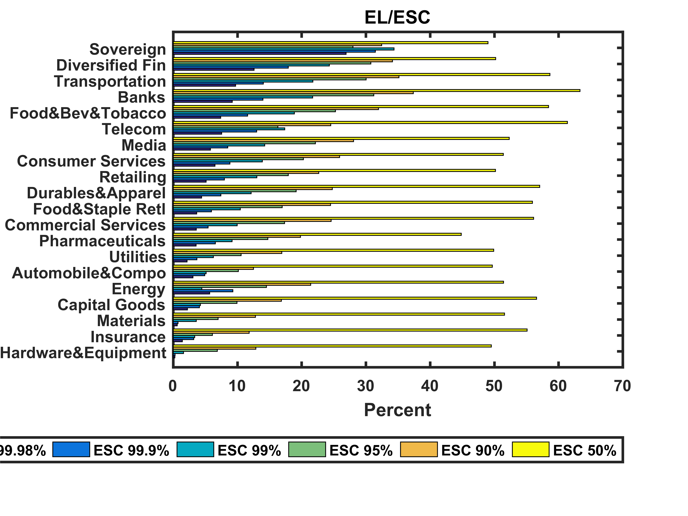

[](http://quantlet.de/)

## [](http://quantlet.de/) **XFGexc** [](http://quantlet.de/)

```yaml

Name of QuantLet : XFGexc

Published in : Applied Quantitative Finance

Description : 'Counts 99% Value-at-Risk exceedences over a profit and loss function for basic
simulation data.'

Keywords : simulation, Loss-Profit function, VaR, exceedance, counts

Author : Germar Knöchlein, Awdesch Melzer

Submitted : Fri, June 29 2012 by Dedy Dwi Prastyo

Datafile : XFGMMPL.dat, XFGPL.dat

```




### R Code:
```r
rm(list = ls(all = TRUE))
graphics.off()

# load data
PL = read.table("XFGPL.dat")
MMPL = read.table("XFGMMPL.dat")

# main computation
m = nrow(PL)
t = 1
Exc = 0
while (t <= m) {
    q = quantile(t(PL[t, ]), p = 0.99, type = 1)  # 99% quantile
    if (q < MMPL[t, 1]) {
        # counts exceeding values of q in MMPL
        Exc = Exc + 1
    }
    t = t + 1
}
Exc = Exc/m
Exc 

```

### MATLAB Code:
```matlab
close all
clc

% load data
  PL = load('XFGPL.dat');
  MMPL = load('XFGMMPL.dat');

% main computation
  [m n] = size(PL);              % m = number of rows
  t = 1;
  Exc = 0;
  while (t<=m)
    q = quantile(PL(t,:)',0.99); % 99% quantile of PL
    if (q<MMPL(t,1))             % counts exceeding values of q in MMPL
      Exc = Exc+1;
    end
    t = t+1;
  end
  Exc = Exc/m


```
