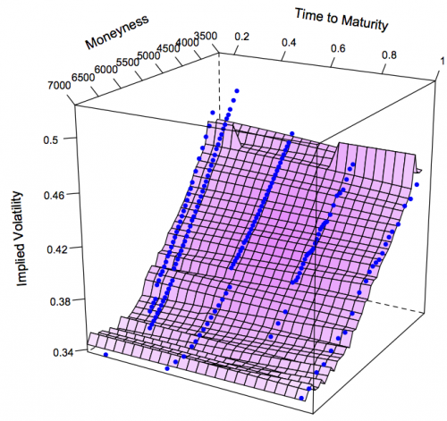

[](http://quantlet.de/)

## [](http://quantlet.de/) **XFGiv02** [](http://quantlet.de/)

```yaml

Name of QuantLet : XFGiv02

Published in : Applied Quantitative Finance

Description : 'Estimates an implied volatility surface applying the Black and Scholes formula, an
iterative algorithm to estimate the implied volatility employing the bisection method, and
localized kernel regression using the Nadaraya Watson estimator with bandwidths bw = c(250,0.5) for
moneyness and time to maturity for a quartic kernel. A 3D graphical illustration is given.'

Keywords : '3D, Nadaraya Watson, bandwidth, black-scholes, implied-volatility, local polynomial,
nonparametric, quartic, regression'

See also : STFfft01, XFGLSK, XFGiv00, XFGiv01, XFGiv03, XFGiv04, XFGiv05, XFGiv06

Author : Awdesch Melzer

Submitted : Thu, June 26 2014 by Awdesch Melzer

Datafiles : volsurfdata2.dat

```




### R Code:
```r
# clear variables and close windows
rm(list=ls(all=TRUE))
graphics.off()

# setwd("C:/...") # set working directory

# install and/or open required package for general inversion function
install.packages("regpro")
library(regpro)

############################ SUBROUTINE ################################

# BlackScholes price for a European Call or Put Option 
BlackScholes = function(S, K, r, sigma, tau, task){
    S     = c(S)        # spot price
    K     = c(K)        # exercise price
    tau   = c(tau)      # time to maturity
    sigma = c(sigma)    # volatility, std error
    r     = c(r)        # interest rate  
    if(task == "call" || task == "Call" || task == "CALL"){
        task = 1     # call option
    }else{
        if(task == "put" || task == "Put" || task == "PUT"){
            task = 0     # put option
        }
    }  
    if((min(S)<=0)){
        stop("BlackScholes: price needs to be larger than 0")
    }
    if((min(K)<=0)){
        stop("BlackScholes: strike price needs to be larger than 0")
    }
    if(((task!=0)&(task!=1))){
        stop("BlackScholes: task needs to be either 1 or 0")
    }
    if(((r<=0)|(r>=1))){
        stop("BlackScholes: interest rate needs to be between 0 and 1")
    }
    if((min(r)<0)){
        stop("BlackScholes: interest rate can not be negative")
    }
    if(min(sigma)<=0){
        stop("BlackScholes: volatility needs to be larger than 0")	
    }  
    if(min(tau)<0){
        stop("BlackScholes: time to expiration can not be negative")	
    }
    # Black-Scholes formula #
    t    = (tau==0) # check if it is the expire day   							
    y    = (log(S/K)+(r-sigma^2/2)*tau)/(sigma*sqrt(tau)+t)
    if (task==1){
        opv   = S*(pnorm(y+sigma*sqrt(tau))*(!t)+t)-K*exp(-r*tau)*(pnorm(y)*(!t)+t)
    } 
    if (task==0){
        opv   = K*exp(-r*tau)*(pnorm(-y)*(!t)+t)-S*(pnorm(-y-sigma*sqrt(tau))*(!t)+t)
    }
    opv  = (opv>0)*opv
    return(opv)	
}
 
# Function to find BS Implied Vol using Bisection Method
ImplVola = function(S, K, Time, r, market, type){
    sig      = 0.20  # start value
    sig.up   = 1     # upper bound
    sig.down = 0.001 # lower bound
    count    = 0     # iteration
    err      = BlackScholes(S, K, r, sig, Time, type) - market 
    # repeat until error is sufficiently small or counter hits 1000
    while(abs(err) > 0.00001 && count<1000){
        if(err < 0){
            sig.down  =  sig
            sig       =  (sig.up + sig)/2
        }else{
            sig.up  =  sig
            sig     =  (sig.down + sig)/2
        }
        err    =  BlackScholes(S, K, r, sig,Time, type) - market
        count  =  count + 1
    }
    # return NA if counter hit 1000
    if(count==1000){
        return(NA)
    }else{
        return(sig)
    }
}

############################ Main Computation ############################  
 
# load data
x         = read.table("volsurfdata2.dat")  # data input
ptm       = proc.time()

# define variables
x[,7]     = x[,2]                           # Define Moneyness
Price     = x[,1]                           # Spot price
Strike    = x[,2]                           # Strike price
Rate      = x[,3]                           # Risk-free interest rate
Time      = x[,4]                           # Time to maturity
Value     = x[,5]                           # Market value
Class     = x[,6]                           # Call==1 | Put==0
mon       = x[,7]                           # Moneyness

n         = length(x[,1])                   # number of observations

# calculate implied volatility
iv        = rep(0,n)
for(i in 1:n){
    iv[i] = ImplVola(S=Price[i], K=Strike[i],Time=Time[i], r=Rate[i], market=Value[i],type=Class[i]);
}

stepwidth = c(70,(1/52))                  # step width for grid
bandwidth = c(250,0.5)                    # bandwidth for kde
firstmon  = min(x[,7])                      # lower bound of Moneyness
lastmon   = max(x[,7])                      # upper bound of Moneyness
firstmat  = min(x[,4])                      # lower bound of time to maturity
lastmat   = max(x[,4])                      # upper bound of time to maturity

firstXF   = 3500                            # lower bound labels Moneyness
lastXF    = 7000                            # upper bound labels Moneyness
firstMat  = 0                               # lower bound labels Maturity
lastMat   = 1                               # upper bound labels Maturity

l         = 51 

mongrid   = seq(firstmon,lastmon,length=l)# grid Moneyness
matgrid   = seq(firstmat,lastmat,length=l)# grid time to maturity

# grid function
IV        = pcf.kernesti(x=cbind(Time,mon),y=iv, N=c(l,l),h=bandwidth,kernel="gauss",support=cbind(mongrid,matgrid))

IV        = matrix(IV$value,l,l)     # estimated surface of implied volatility

meshgrid  = function(a,b){
    list(
        x  = outer(b*0,a,FUN="+"),
        y  = outer(b,a*0,FUN="+")
    )
} 
 
# expand grid
gridone   = meshgrid(mongrid,matgrid);

MON       = gridone$x 
MAT       = gridone$y

# define points for the plot
pts               = cbind(mon, Time, iv) 

proc.time() - ptm

# load required package for 3D graphics
require(lattice)

# plot

wireframe(IV~MON+MAT,zlim=c(min(IV),max(iv)),xlim=c(firstXF,lastXF),ylim=c(min(MAT),max(lastMat)),ticktype="detailed",drape=T,colorkey=F, pts=pts,main="", aspect = c(1,1),scales=list(arrows=FALSE, y=list(labels=round(seq(firstMat,lastMat,length=6),2)),x=list(labels=round(seq(firstXF,lastXF,length=8),2)),z=list(labels=round(seq(min(IV),max(IV),length=6),2))), ylab=list("Time to Maturity",rot=-8), xlab=list("Moneyness",rot=25), zlab=list("Implied Volatility",rot=94) ,screen = list(z = 240, x = -70),
          panel.3d.wireframe = function(x,y,z,xlim,ylim,zlim,xlim.scaled,ylim.scaled,zlim.scaled,pts,drape=drape,...){
    panel.3dwire(x,y,z, xlim=xlim, ylim=ylim, zlim=zlim, 
                 xlim.scaled=xlim.scaled, ylim.scaled=ylim.scaled, 
                 zlim.scaled=zlim.scaled,drape=TRUE,...) 
    panel.3dscatter(pts[,1], pts[,2], pts[,3], 
                    xlim=xlim, ylim=ylim, zlim=zlim, 
                    xlim.scaled=xlim.scaled, ylim.scaled=ylim.scaled, 
                    zlim.scaled=zlim.scaled, type="p", col=c(4), lwd=3, 
                    cex=0.7, pch=c(16), .scale=TRUE, ...)
})

```
