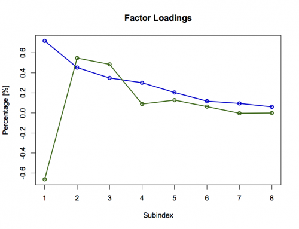

[](http://quantlet.de/)

## [](http://quantlet.de/) **XFGiv05** [](http://quantlet.de/)

```yaml

Name of QuantLet : XFGiv05

Published in : Applied Quantitative Finance

Description : 'Displays first and second eigenvectors of the VDAX index for the ATM implied
volatility data (implvola.dat). Taking only the first two factors, the time series of implied ATM
volatilities can be represented by a factor model of reduced dimension: x(t,j) = gamma(j,1)*y(t,1)
+ gamma(j,2)*y(t,2) + epsilon(t). gamma(j) are sensitivities of the implied volatility time series
to shocks of the principal components. A shock of the first factor tends to affect all maturities
in a similar way, causing a non-parallel shift of the term structure. A shock of the second factor,
on the other hand, has a strong negative impact on the front maturity but a positive impact on the
longer ones, thus causing a change of curvature in the term structure of implied volatilities.'

Keywords : 'covariance, dimension-reduction, eigenvalues, eigenvectors, factor-loadings,
factor-model, implied-volatility, pca, principal-component-analysis, principal-components,
spectral-decomposition'

See also : XFGLSK, XFGiv00, XFGiv01, XFGiv02, XFGiv03, XFGiv04, XFGiv06

Author : Awdesch Melzer

Submitted : Wed, May 28 2014 by Awdesch Melzer

Datafiles : implvola.dat

```




### R Code:
```r
# clear cache and close windows
rm(list=ls(all=TRUE))
graphics.off()
 
x          = read.table("implvola.dat") # load data
x          = x*100                      # scale
n          = nrow(x)                    # number of rows
z          = x[2:n,] - x[1:(n-1),]      # first difference
s          = cov(z)*100000              # covariance of returns
tmp        = eigen(s)                   # spectral decomposition
l          = tmp$values                 # eigenvalues
g          = tmp$vectors                # eigenvectors
g[,2]      = g[,2]*(-1)                 # correction of sign for publication purpose
  
gr1        = cbind(1:8,g[,1])           # first principal component
gr2        = cbind(1:8,g[,2])           # second principal component

plot(gr1,type="l",col="blue3",xlab="Subindex",ylab="Percentage [%]",lwd=2,ylim=c(min(g[,1:2]),max(g[,1:2])))
points(gr1,col="blue3",lwd=2,pch=1)
title("Factor Loadings")
lines(gr2,col="darkgreen",lwd=2)
points(gr2,col="darkgreen",lwd=2)


```
