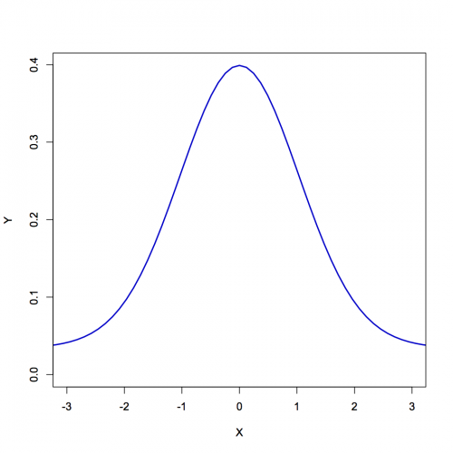

[](http://quantlet.de/)

## [](http://quantlet.de/) **gFourierInversion** [](http://quantlet.de/)

```yaml

Name of QuantLet : gFourierInversion

Published in : Applied Quantitative Finance

Description : 'Is a generic function that approximates the density of a distribution function by
numerically inverting its characteristic function.'

Keywords : FFT, Fourier inversion, characteristic function, approximation, density

See also : StandardNormalCharf, VaRcdfDG, VaRqDG, XFGqDGtest

Author : Awdesch Melzer

Submitted : Tue, June 04 2013 by Awdesch Melzer

Usage : r = gFourierInversion(N,K,dt,t0,x0,charf,l)

Input: 
- n: scalar, the modulus of the Fast Fourier Transform (FFT) used; should be a power of 2.
- K: 'scalar, the number of evaluations of the characteristic function; K has to be smaller or
equal to N; when K < N, the input vector is filled with zeros up to N.'
- dt: scalar, the grid-size in t used for the approximation of the inversion integral
- t0: scalar, indicating whether the t-grid includes t = 0 (t0==0) or t = dt/2 (otherwise)
- x0: scalar, the starting point of the x-grid
- charf: string, the name of the characteristic function
- l: 'list, containing l$mu (the expectation) and l$sigma (the standard deviation) of the
characteristic function (charf).'

Output: 
- rn: '(rn x 1) - vector containing the density values on the x-grid. The grid is given by x_j =
x_0 + j dx, dx = 2 pi/(N dt)'

Example : 'Approximates the standard normal density and plots it. mu = 0 sigma = 1 par =
list(mu=mu,sigma=sigma) r =
gFourierInversion(N=512,K=512,dt=0.1,t0=0.05,x0=-pi/0.1,charf=StandardNormalCharf,l=par) z =
cbind((-pi/0.1+(0:511)*2*pi/(512*0.1)) , r) plot(z,
type="l",col="blue3",lwd=2,xlab="X",ylab="Y",xlim=c(-3,3))'

```




### R Code:
```r
compl = function(re, im) {
    # Complex array generation
    if (missing(re)) {
        stop("compl: no composed object for real part")
    }
    if (missing(im)) {
        im = 0 * (re <= Inf)
    }
    if (nrow(matrix(re)) != nrow(matrix(im))) {
        stop("compl: dim(re)<>dim(im)")
    }
    z = list()
    z$re = re
    z$im = im
    return(z)
}

cmul = function(x, y) {
    # Complex multiplication
    re = x$re * y$re - x$im * y$im
    im = x$re * y$im + x$im * y$re
    z = list()
    z$re = re
    z$im = im
    return(z)
}

cexp = function(x) {
    # Complex exponential
    re = exp(x$re) * cos(x$im)
    im = exp(x$re) * sin(x$im)
    z = list()
    z$re = re
    z$im = im
    return(z)
}

creal = function(z) {
    # Returning real part
    re = z$re
    return(re)
}

StandardNormalCharf = function(t, l) {
    # Standard Normal Characteristic Function
    s2 = l$sigma^2
    tmp = compl(-0.5 * s2 * t$re, -0.5 * s2 * t$im + l$mu)
    r = cexp(cmul(tmp, t))
    return(r)
}

#################### MAIN FUNCTION ####################

gFourierInversion = function(N, K, dt, t0, x0, charf, l) {
    # 1. form the grids:
    dx = (2 * pi)/(N * dt)
    t = (0:(K - 1)) * dt
    if (t0 != 0) {
        t = t + dt/2
    }
    t = compl(t, t * 0)
    x = x0 + (0:(N - 1)) * dx
    # 2. do the FFT:
    tmp = charf(t, l)
    phi = matrix(1, N, 2)
    phi[1:K, 1] = tmp$re
    phi[1:K, 2] = tmp$im
    tmp = x0 * dt * (0:(N - 1))
    phi = cmul(compl(phi[, 1], phi[, 2]), cexp(compl(tmp * 0, -tmp)))
    phi = cbind(phi$re, phi$im)
    phitmp = complex(real = phi[, 1], imaginary = phi[, 2])
    ninvfft = length(phitmp)
    y = fft(phitmp, inverse = T)  #ninvfft
    y = compl(Re(y), Im(y))
    if (t0 != 0) {
        tmp = x * dt/2
        y = cmul(y, cexp(compl(tmp * 0, -tmp)))
    }
    # 3. rescale:
    if (t0 == 0) {
        r = dt * (creal(y) - 0.5 * creal(charf(list(re = 0, im = 0), l)))/pi
    } else {
        r = dt * creal(y)/pi
    }
    return(r)
}

####################### TEST ######################

mu = 0
sigma = 1
par = list(mu = mu, sigma = sigma)
r = gFourierInversion(N = 512, K = 512, dt = 0.1, t0 = 0.05, x0 = -pi/0.1, charf = StandardNormalCharf, l = par)
z = cbind((-pi/0.1 + (0:511) * 2 * pi/(512 * 0.1)), r)
plot(z, type = "l", col = "blue3", lwd = 2, xlab = "X", ylab = "Y", xlim = c(-3, 3)) 

```
